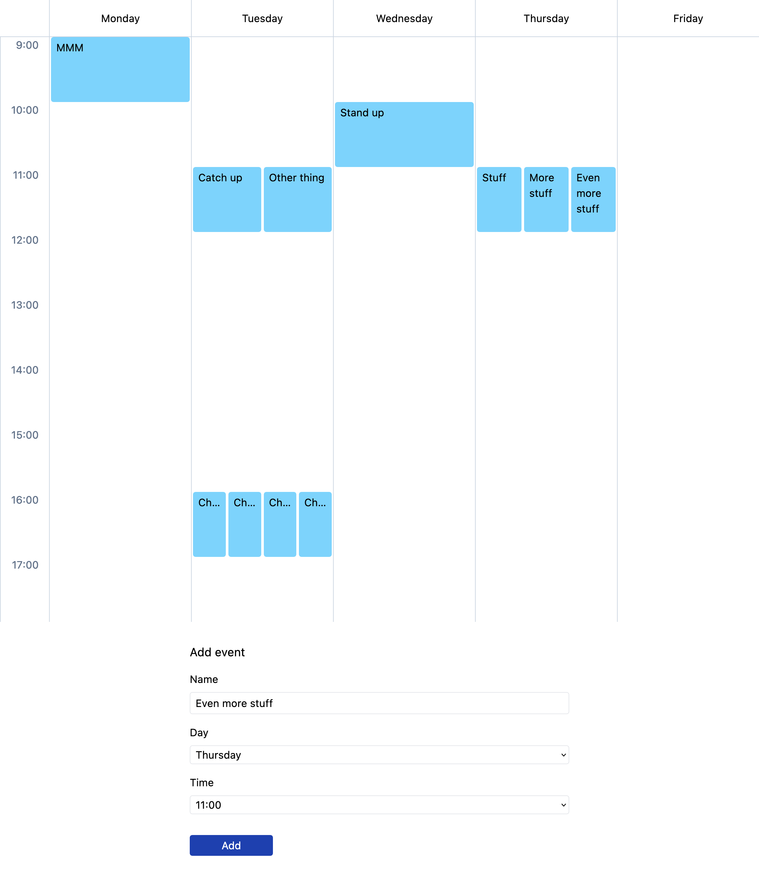

# Vitamin - Tech Test - George Brooks 
1. `npm i`
2. `http-server`
3. go to `localhost:8080`
# Vitamin London Tech test

Your task is to build a simplified calendar view with a basic form that let’s the user add events to the calendar.

## Instructions

- Feel free to use whatever language and tools you feel most familar with
- Calendar should show a grid with the days Monday to Friday
- Calendar should show the times 9:00 to 18:00, with timestamps in a sidebar down the side
- All events are one hour long
- Events always start on the hour (e.g. 9:00, 10:00, 11:00 etc.)
- There should be a form where the user can enter the following information to add events to the calendar:
  - Event name
  - Event day (Mon-Fri)
  - Event time (09:00 - 17:00)
- Events should take up the full width of the column for that day. If there are multiple events occuring at the same time on the same day they should each take an equal portion of the column width (e.g. ½ width for 2 events, ⅓ width for 3 events etc, see screenshot below for examples)
- The calendar should be styled similar to the screenshot below, but don’t worry too much about getting the styling perfect, the functionality is more important
- Try to treat the task as you would a task in your regular day job (e.g. regular git commits, well structured code)

## Stretch goals

If you have time:

- Add in an animation when a new event is created ✨
- Remove the restriction on events only being an hour long, and only occuring on the hour, whilst still making sure events don’t visually overlap in the calendar view.

## Tips:

- Don’t spend more than a couple of hours on the task. Don't worry if you aren’t able to complete the task in the time you have available. We are primarily interested in seeing how you approach and tackle the problem
- If any of the requirements are unclear use your best judgement to proceed and just document any assumptions you make along the way (perhaps via code comments if suitable)

## Example screenshot

## Example screen recording

